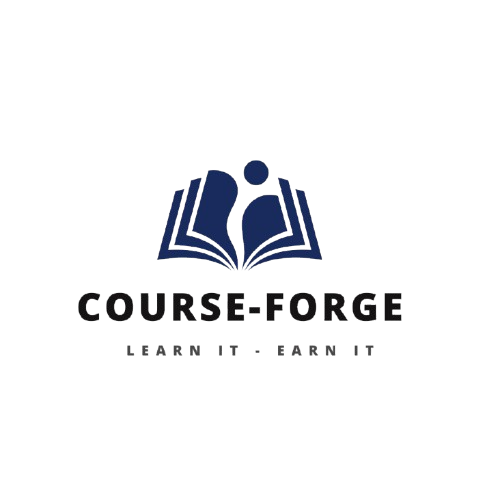

<p align="center">
  
</p>

<h1 align="center">CourseForge</h1>
<p align="center"><i>An E-learning platform for enthusiastic learners with every resource and services they'd ever seek. </i></p>

---
<p>
<p>
<p>
  
## Current Status

We're still in building phase as this is the first week of development. The groundwork for the application is there but there's yet to add lots and lots of functionality. However, a simple general workflow is still possible with the current version. The UI/UX isn't there yet indeed but for now we're just happy with how it works.

---
<p>
<p>
<p>
  
## About CourseForge

CourseForge is a full-stack web application where-

--admins can build and design any structured courses out of respective chapters and learning materials.  
--students can browse, enroll, work through the available content at their own pace.

And ideally later on..
  The courses will be organized and structured into different chapters, with individual places of content like( docs, recorded lectures etc.) which will be LOCKED until a student enrolls. After enrollment, the student can access their unlocked course materials, complete different quizzes of their choice and most importantly track their progress as they move through it. Admins will be able to manage the full lifecycle on their end (creating and editing courses, uploading study materials and reviewing who have enrolled).

---
<p>
<p>
<p>
  
## App Features

**Student side**
-  Browse through the available courses  
-  Enroll via payment flow  
-  Access their unlocked contents  
-  Take quizzes on topics of their choice  
-  Track their progress  

**Admin side**
-  Create/edit/delete courses
-  Upload study materials
-  Manage enrollements
-  Build quizzes

---
<p>
<p>
<p>
  
## Tech Stack

- React with Vite - Frontend
- Node JS with Express - Backend (planning)
- Cloudinary - File storage (planning)
- JWT - Authentication (planning)
- Vercel and Render - Deployment (planning) { for now - github pages}

---
<p>
<p>
<p>
  
## Some Glimpses

[{(BIRAJJ WILL ADD HOME PAGE SCREENSHOT HERE AND REMOVE THIS LINE)}]}

---
<p>
<p>
<p>
  
## Getting Started


### Prerequisites
- None for now 

### Installation

```bash
# To clone the repo
git clone https://github.com/Aarjal/CourseForge.git
cd courseforge

# To install frontend dependencies
cd ../client
npm install
```

### Running locally

```bash

# To start frontend 
cd client
npm start
```

---
<p>
<p>
<p>
  
Built as part of **[Thirdspace YSWS]** with great love and effort :)

